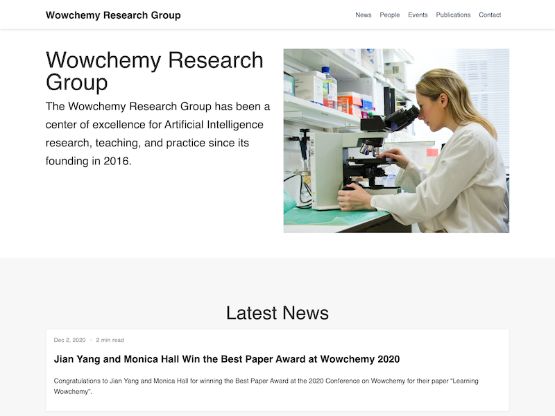

<?xml version="1.0" encoding="utf-8" standalone="yes" ?>
<rss version="2.0" xmlns:atom="http://www.w3.org/2005/Atom">
  <channel>
    <title>My Website</title>
    <link>https://ineskris.github.io/</link>
      <atom:link href="https://ineskris.github.io/index.xml" rel="self" type="application/rss+xml" />
    <description>My Website</description>
    <generator>Source Themes Academic (https://sourcethemes.com/academic/)</generator><language>en-us</language><lastBuildDate>Mon, 14 Sep 2020 00:00:00 +0000</lastBuildDate>
    <image>

- my name is Maram 
- color "blue" I am 31 old

 [Link to another page](http://www.google.com) 
 

=======
 [Link to another page](http://www.google.com) 

+ some-text + 

 
 

